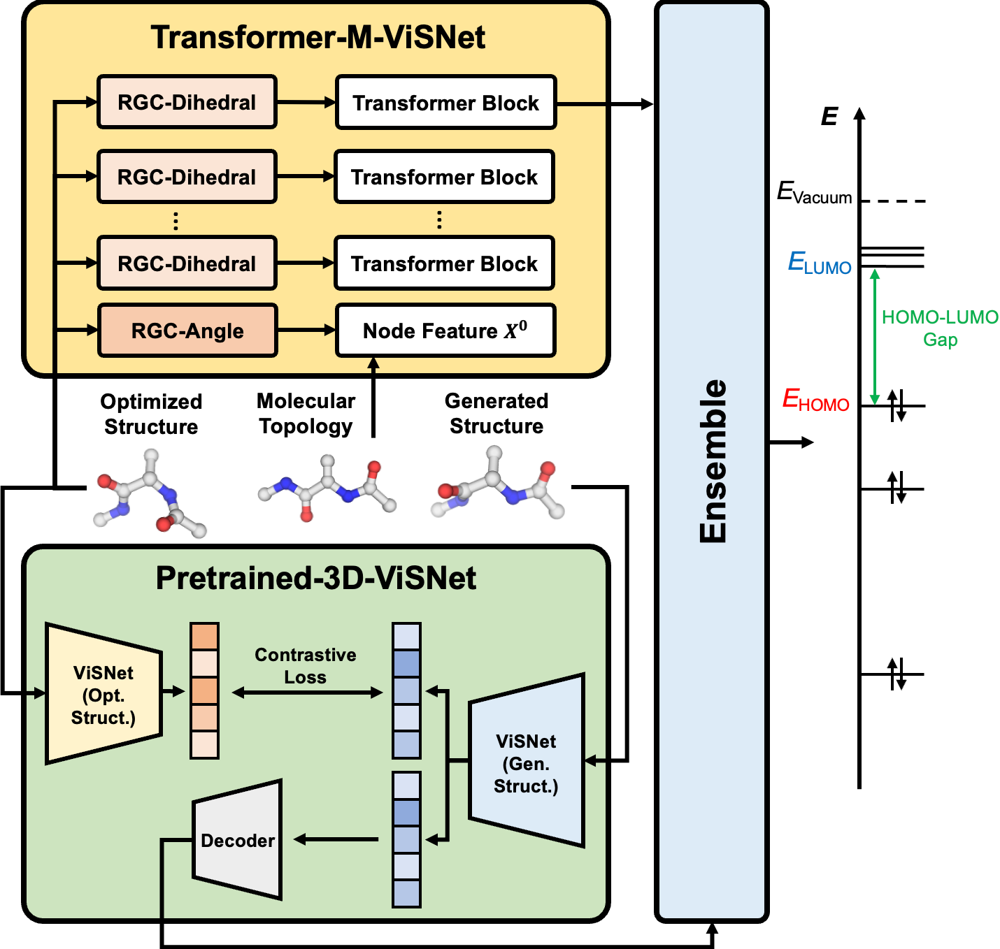

# An ensemble of ViSNet, Transformer-M, and pretraining models for molecular property prediction in OGB Large-Scale Challenge @ NeurIPS 2022
(The 2nd Place Solution of OGB LSC @ NeurIPS 2022 PCQM4Mv2 Track)

## Overview
This is the official repository for the solution of ***ViSNet Team*** for OGB Large-Scale Challenge @ NeurIPS 2022 Graph Regression Task.
The target of this task is to predict the quantum chemical property, **HOMO-LUMO gap** for a given molecule on PCQM4Mv2 dataset.
In the competition, we designed two kinds of models: **Transformer-M-ViSNet** which is an geometry-enhanced graph neural network for fully connected molecular graphs and **Pretrained-3D-ViSNet** which is a pretrained ViSNet by distilling geomeotric information from optimized structures. 



With an ensemble of 22 models and the post-processing based on domain knowledge, *ViSNet* Team achieved the MAE of **0.0723 eV** on the test-challenge set, dramatically reducing the error by 39.75\% compared with the best method in the last year competition.

## Installation

- Clone this repository (Branch: OGB-LSC@NIPS2022)

```shell
git clone https://github.com/microsoft/ViSNet.git -b OGB-LSC@NIPS2022
```

- Install the dependencies

```shell
conda create -y -n ogb python=3.9
conda activate ogb
conda install pytorch==1.11.0 torchvision==0.12.0 torchaudio==0.11.0 cudatoolkit=11.3 -c pytorch
conda install pyg -c pyg
conda install -c conda-forge openbabel
pip install pytorch-lightning==1.5.10
pip install rdkit-pypi==2021.9.2.1
pip install ogb cython networkx ase pyscf pyscf[geomopt]
cd ViSNet
python setup_cython.py build_ext --inplace
```

- For faster training install NVIDIA's apex library, but we recommend using the native AMP in Pytorch:
```shell
git clone https://github.com/NVIDIA/apex
cd apex
pip install -v --disable-pip-version-check --no-cache-dir --global-option="--cpp_ext" --global-option="--cuda_ext" ./
```

## Reproducing our test-challenge submission file

We provide a script to prepare everything, including downloading the dataset, pre-processing the dataset, inferencing all models, ensembling all results and post-processing the ensembled result, just run:

```shell
bash reproduce.sh
```

The submission file ```y_pred_pcqm4m-v2_test-challenge.npz``` is in the generated ```results``` folder.

## Single-model Inference

### Transformer-M-ViSNet

To inference our Transformer-M-ViSNet on the test-challenge dataset, just run:

```shell
CUDA_VISIBLE_DEVICES=0 python train.py --conf examples/OGB-Transformer-M-ViSNet.yaml --load-model checkpoints/Transformer_M_ViSNet_ckpt/Transformer_M_ViSNet_ckpt_<ckpt_num>.ckpt --dataset-root ogb2022-dataset/Transformer_M_ViSNet_dataset/ --log-dir results/test-challenge-tm-visnet-<ckpt_num>/ --inference-dataset test-challenge --task inference --is-submit
```

If one wants to inference on the test-dev dataset, 
please remove the ```is-submit``` argument and change ```test-challenge``` to ```test-dev```.

### Pretrained-3D-ViSNet

To inference our Pretrained-3D-ViSNet on the test-challenge dataset, just run:

```shell
export tc=True && bash OGB_ViSNet/preprocess/preprocess.sh

CUDA_VISIBLE_DEVICES=0 python train.py --conf examples/OGB-Pretrained-3D-ViSNet.yaml --load-model checkpoints/Pretrained_3D_ViSNet_ckpt/Pretrained_3D_ViSNet_ckpt_<ckpt_num>.ckpt --dataset-root ogb2022-dataset/Pretrained_3D_ViSNet_dataset/ --log-dir results/test-challenge-pt-visnet-<ckpt_num>/ --inference-dataset test-challenge --task inference --is-submit
```

If one wants to inference on the test-dev dataset, 
please set ```tc``` to ```False```, remove the ```is-submit``` argument and change ```test-challenge``` to ```test-dev```.

## Single-model Training

### Transformer-M-ViSNet

To train our Transformer-M-ViSNet from scratch, we recommend using the default setting on 4 NVIDIA A100s. The time cost for the whole training process is around 4 days. 

```shell
python train.py --conf examples/OGB-Transformer-M-ViSNet.yaml --dataset-root ogb2022-dataset/Transformer_M_ViSNet_dataset/ --log-dir ./ogb2022-logs/Transformer-M-ViSNet/ --task train --version v1
```

Feel free to change the setting through the command line (such as ```version```).

### Pretrained-3D-ViSNet

To train our Pretrained-3D-ViSNet from scratch, we recommend using the default setting on 16 NVIDIA V100 GPUs. The time cost for the whole training process is around 3.5 days.

```shell
export tc=False && bash OGB_ViSNet/preprocess/preprocess.sh

python train.py --conf examples/OGB-Pretrained-3D-ViSNet.yaml --dataset-root ogb2022-dataset/Pretrained_3D_ViSNet_dataset/ --log-dir ./ogb2022-logs/Pretrained-3D-ViSNet/ --task train
```

We provide pretrained teacher model ```checkpoints/pretrained_visnet.ckpt```, and one only needs to train the student models from scratch.

## Citation

If you find this work useful, please kindly cite following papers:

Yusong Wang#, Tong Wang#\*, Shaoning Li#, Xinheng He, Mingyu Li, Zun Wang, Nanning Zheng, Bin Shao*, Tie-Yan Liu. Enhancing geometric representations for molecules with equivariant vector-scalar interactive message passing. Nature Communications, 15.1 (2024): 313. 

Yusong Wang, Shaoning Li, Zun Wang, Xinheng He, Bin Shao, Tie-Yan Liu, Tong Wang*. An ensemble of VisNet, Transformer-M, and pretraining models for molecular property prediction in OGB Large-Scale Challenge @ NeurIPS 2022. 	arXiv:2211.12791

## Contact

Please contact <A href="mailto:tongwang.bio@outlook.com">Tong Wang</A> (Project Lead)  for technical support.

## License

This project is licensed under the terms of the MIT license. See [LICENSE](https://github.com/microsoft/ViSNet/blob/OGB-LSC%40NIPS2022/LICENSE) for additional details.

