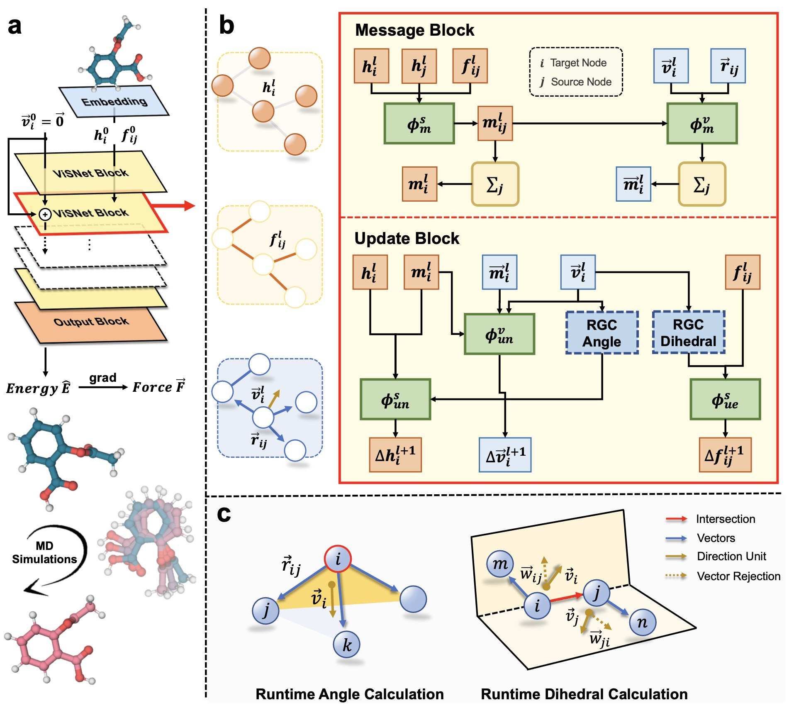

# ViSNet: a scalable and accurate geometric deep learning potential for molecular dynamics simulation

## Overview

[ViSNet](https://arxiv.org/pdf/2210.16518.pdf) (shorted for “**V**ector-**S**calar **i**nteractive graph neural **Net**work”) is a scalable and accurate graph deep learning potential for molecular dynamics that significantly alleviate the dilemma between computational costs and sufficient utilization of geometric information.

 

## News

### Nov 2022
- *ViSNet Team* won the 2nd place in the [OGB-LSC @ NeurIPS 2022 PCQM4Mv2 Track](https://ogb.stanford.edu/neurips2022/results/)! Please check out the branch [OGB-LSC@NIPS2022](https://github.com/microsoft/ViSNet/tree/OGB-LSC%40NIPS2022) and give it a star if you find it useful!
- The paper of ViSNet is under-review. We will release the codebase until it is accepted.

## Citation

If you find this work useful, please kindly cite following paper:

```latex
@article{wang2022visnet,
  title={ViSNet: a scalable and accurate geometric deep learning potential for molecular dynamics simulation},
  author={Wang, Yusong and Li, Shaoning and He, Xinheng and Li, Mingyu and Wang, Zun and Zheng, Nanning and Shao, Bin and Wang, Tong and Liu, Tie-Yan},
  journal={arXiv preprint arXiv:2210.16518},
  year={2022}
}
```

## Contact

Please contact Tong Wang (watong@microsoft.com) for technical support.

## License

This project is licensed under the terms of the MIT license. See [LICENSE](https://github.com/microsoft/ViSNet/blob/main/LICENSE) for additional details.
