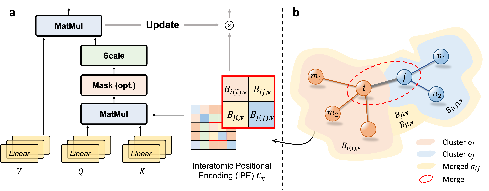

# Geometric Transformer with Interatomic Positional Encoding
## Overview
Authors: Yusong Wang#, Shaoning Li#, Tong Wang*, Bin Shao, Nanning Zheng and Tie-Yan Liu

(#Equal contribution, *Corresponding authors: tongwang.bio@outlook.com (T. W.))

Article: https://neurips.cc/virtual/2023/poster/72577

 

## Environments

- Install the dependencies

```shell
conda create -y -n geoformer python=3.9
conda activate geoformer
conda install pytorch==1.13.1 torchvision==0.14.1 torchaudio==0.13.1 pytorch-cuda=11.6 -c pytorch -c nvidia
conda install pyg==2.4.0 -c pyg
conda install transformers ogb ase
pip install pytorch_lightning==1.8.0
pip install rdkit==2023.09.01
pip install einops
```

## Getting started

To train Geoformer on QM9, just run:

```shell
CUDA_VISIBLE_DEVICES=0 python train.py --conf examples/Geoformer-QM9.yml --dataset-arg energy_U0 --dataset-root /path/to/data --log-dir /path/to/log
```

One can modify the ```dataset-arg``` to train another property like energy_U.

To train Geoformer on Molecule3D, just run:

```shell
python train.py --conf examples/Geoformer-Molecule3D.yml --split-mode random --dataset-root /path/to/data --log-dir /path/to/log
```

One can modify the ```split-mode``` to train on another split strategy.

## Inference

Once Geoformer is trained, to use a pretrained checkpoint for inference, simply run:

```shell
CUDA_VISIBLE_DEVICES=0 python train.py --conf examples/Geoformer-QM9.yml --dataset-arg energy_U0 --dataset-root /path/to/data --log-dir /path/to/log --load-model /path/to/ckpt --task inference
```

We provide [pretrained checkpoints](./examples/energy_U0.ckpt) on the energy_U0 property to reproduce the results in our paper.

## Contact

Please contact <A href="mailto:tongwang.bio@outlook.com">Tong Wang</A> (Project Lead)  for technical support.

## License

This project is licensed under the terms of the MIT license. See [LICENSE](https://github.com/microsoft/ViSNet/blob/main/LICENSE) for additional details.
