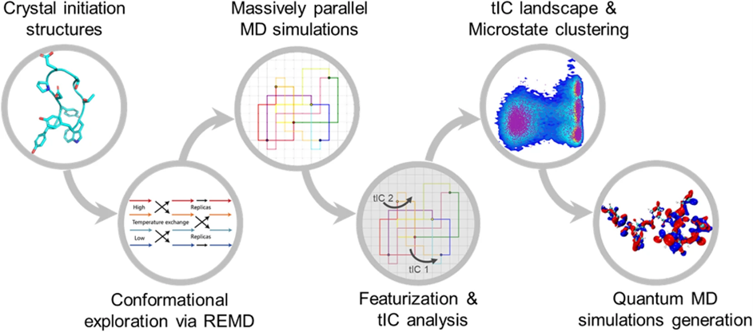
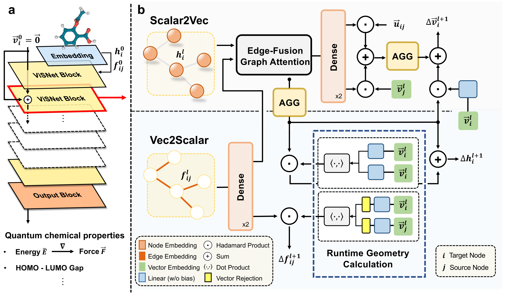

# AI2BMD: AI-powered *ab initio* biomolecular dynamics simulation

## Overview

The AI-powered MD is a generalizable solution to efficiently simulate various proteins with *ab initio* accuracy by machine learning force field. This project consists of our studies on **Datasets**, **Modeling**, **Simulation evaluation and analysis**, which are demonstrated below and in different branches. See [The Homepage of AI2BMD](https://microsoft.github.io/AI2BMD/index.html) and find the preprint version article [AI2BMD: efficient characterization of protein dynamics with ab initio accuracy](https://www.biorxiv.org/content/10.1101/2023.07.12.548519v1.abstract) for more details.

 

*Hiring*: We are hiring research interns, engineering interns and full time employees on MD simulation, quantum chemistry, AIDD, geometry deep learning (GDL), molecular graph neural network, system design and CUDA acceleration. Please send your resume to watong@microsoft.com .

## Datasets

### AIMD-Chig

The whole comformation MD dataset for proteins calculated at Density Functional Theory (DFT) level. AIMD-Chig consists of 2M conformations of the 166-atom *Chignolin* and the corresponding potential energy and atomic forces calculated at M06-2X/6-31g* level.

 

- Read the article [AIMD-Chig: Exploring the conformational space of a 166-atom protein Chignolin with ab initio molecular dynamics](https://www.nature.com/articles/s41597-023-02465-9).

- Find the story [The first whole conformational molecular dynamics dataset for proteins at ab initio accuracy and the novel computational technologies behind it](https://bioengineeringcommunity.nature.com/posts/aimd-chig-exploring-the-conformational-space-of-proteins-at-dft-level).

- Get the dataset [AIMD-Chig](https://figshare.com/articles/dataset/_strong_AIMD-Chig_exploring_the_conformational_space_of_166-atom_protein_strong_em_strong_Chignolin_strong_em_strong_with_strong_em_strong_ab_initio_strong_em_strong_molecular_dynamics_strong_/22786730).

## Modeling

### ViSNet

ViSNet (shorted for “**V**ector-**S**calar **i**nteractive graph neural **Net**work”) is an equivariant geometry-enhanced graph neural for molecules that significantly alleviate the dilemma between computational costs and sufficient utilization of geometric information. ViSNet has won the Championship in [The First Global AI Drug Development Competition](https://aistudio.baidu.com/competition/detail/1012/0/leaderboard) and one of the winners in [OGB-LSC @ NeurIPS 2022 PCQM4Mv2 Track](https://ogb.stanford.edu/neurips2022/results/)! 

 

- Please check out the branch [ViSNet](https://github.com/microsoft/AI2BMD/tree/ViSNet) for the source code, instruction on model training and more techniqucal details.
  
- Read the preprint version article [ViSNet: an equivariant geometry-enhanced graph neural network with vector-scalar interactive message passing for molecules](https://arxiv.org/abs/2210.16518).  

## Simulation evaluation and analysis

### Fine-grained force metrics for MLFF

Machine learning force fields (MLFFs) have gained popularity in recent years as they provide a cost-effective alternative to *ab initio* molecular dynamics (MD) simulations. Despite a small error on the test set, MLFFs inherently suffer from generalization and robustness issues during MD simulations. To alleviate these issues, we propose global force metrics and fine-grained metrics from element and conformation aspects to systematically measure MLFFs for every atom and every conformation of molecules. Furthermore, the performance of MLFFs and the stability of MD simulations can be further improved guided by the proposed force metrics for model training, specifically training MLFF models with these force metrics as loss functions, fine-tuning by reweighting samples in the original dataset, and continued training by recruiting additional unexplored data.

- Read the Cover Story article [Improving machine learning force fields for molecular dynamics simulations with fine-grained force metrics](https://pubs.aip.org/aip/jcp/article-abstract/159/3/035101/2902663/Improving-machine-learning-force-fields-for?redirectedFrom=fulltext) .

## Contact

Please contact Dr. Tong Wang (watong@microsoft.com) for technical support.

## License

This project is licensed under the terms of the MIT license. 
