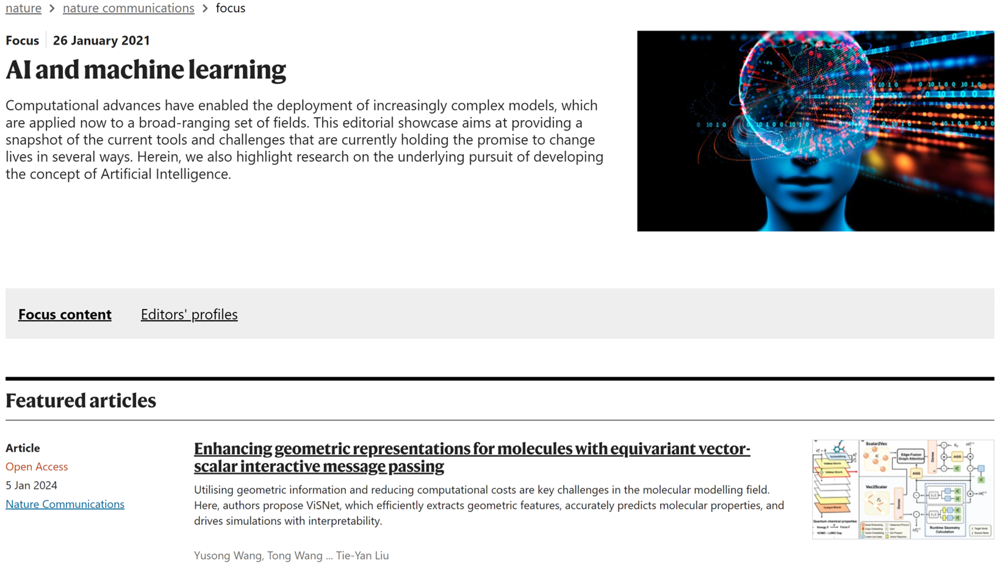
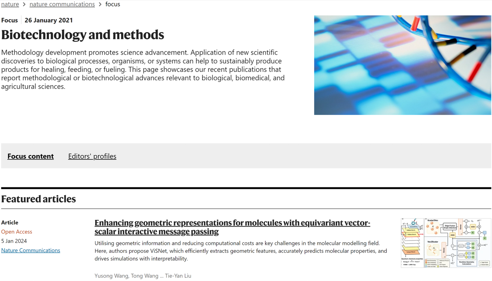
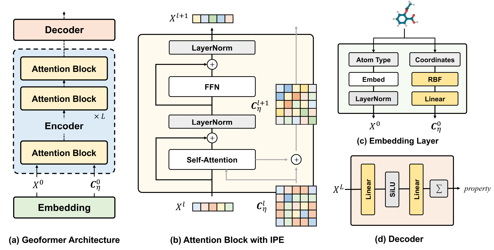

# AI<sup>2</sup>BMD: AI-powered *ab initio* biomolecular dynamics simulation

## Contents

- [Overview](#overview)
- [Datasets](#datasets)
- [System Requirements](#system-requirements)
- [Installation Guide](#installation-guide)
- [Demo](#demo)
- [Model Architectures](#model-architectures)
- [Related Research](#ai2bmd-related-research)
- [Citation](#citation)
- [License](#license)

## Overview

AI<sup>2</sup>BMD is a program for efficiently simulating protein molecular dynamics with *ab initio* accuracy. This repository contains datasets, model architectures, simulation programs, and papers related to AI<sup>2</sup>BMD.

 

## Datasets

### AIMD-Chig

The whole comformation MD dataset for proteins calculated at Density Functional Theory (DFT) level. AIMD-Chig consists of 2M conformations of the 166-atom *Chignolin* and the corresponding potential energy and atomic forces calculated at M06-2X/6-31g* level.

 

- Read the article [AIMD-Chig: Exploring the conformational space of a 166-atom protein Chignolin with ab initio molecular dynamics](https://www.nature.com/articles/s41597-023-02465-9).

- Find the story [The first whole conformational molecular dynamics dataset for proteins at ab initio accuracy and the novel computational technologies behind it](https://bioengineeringcommunity.nature.com/posts/aimd-chig-exploring-the-conformational-space-of-proteins-at-dft-level).

- Get the dataset [AIMD-Chig](https://figshare.com/articles/dataset/_strong_AIMD-Chig_exploring_the_conformational_space_of_166-atom_protein_strong_em_strong_Chignolin_strong_em_strong_with_strong_em_strong_ab_initio_strong_em_strong_molecular_dynamics_strong_/22786730).

### System Requirements

## Hardware Requirements

We recommend a machine with the following specs:

- **CPU**: 8+ cores
- **Memory**: 32+ GB
- **GPU**: CUDA-enabled GPU with 8+ GB memory

## Software Requirements

The package has been tested on the following systems:

- **OS**: Ubuntu 20.04
- **Python**: 3.9
- **CUDA**: 11.3
- **cuDNN**: 8

## Installation Guide

### Step 1: Clone the repository
```bash
git clone https://github.com/microsoft/AI2BMD
cd AI2BMD
```

### Step 2: Download the docker image
```bash
docker pull microsoft/ai2bmd:latest
```

## Demo

Coming soon

## Model Architectures

### ViSNet

ViSNet (shorted for “**V**ector-**S**calar **i**nteractive graph neural **Net**work”) is an equivariant geometry-enhanced graph neural for molecules that significantly alleviate the dilemma between computational costs and sufficient utilization of geometric information.

 

- ViSNet is published on *Nature Communications* [Enhancing geometric representations for molecules with equivariant vector-scalar interactive message passing](https://www.nature.com/articles/s41467-023-43720-2)

- ViSNet is selected as "Editors' Highlights" for both ["**AI and machine learning**"](https://www.nature.com/collections/ceiajcdbeb) and ["**Biotechnology and methods**"](https://www.nature.com/collections/idhhgedgig) fields of Nature Communications.


 

- ViSNet has won the Championship in [The First Global AI Drug Development Competition](https://aistudio.baidu.com/competition/detail/1012/0/leaderboard) and one of the winners in [OGB-LSC @ NeurIPS 2022 PCQM4Mv2 Track](https://ogb.stanford.edu/neurips2022/results/)! 

- Please check out the branch [ViSNet](https://github.com/microsoft/AI2BMD/tree/ViSNet) for the source code, instruction on model training and more techniqucal details.
  
### Geoformer
Geoformer (short for "**Geo**metric Trans**former**") is a novel geometric Transformer to effectively model molecular structures for various molecular property prediction. Geoformer introduces a novel positional encoding method, i.e., Interatomic Positional Encoding (IPE) to parameterize atomic environments in Transformer. By incorporating IPE, Geoformer models valuable geometric information beyond pairwise distances for Transformer-based architecture. Geoformer can be recognized as a Transformer variant of ViSNet.

- Geoformer is published on 37th Conference on Neural Information Processing Systems (NeurIPS 2023).
- Read the paper of Geoformer [Geometric Transformer with Interatomic Positional Encoding](https://github.com/microsoft/AI2BMD/tree/Geoformer/Geoformer.pdf).
- Please check out the branch [Geoformer](https://github.com/microsoft/AI2BMD/tree/Geoformer) for the source code, instruction on model training and more techniqucal details.



##  AI<sup>2</sup>BMD Related Research

### Fine-grained force metrics for MLFF

Machine learning force fields (MLFFs) have gained popularity in recent years as they provide a cost-effective alternative to *ab initio* molecular dynamics (MD) simulations. Despite a small error on the test set, MLFFs inherently suffer from generalization and robustness issues during MD simulations. To alleviate these issues, we propose global force metrics and fine-grained metrics from element and conformation aspects to systematically measure MLFFs for every atom and every conformation of molecules. Furthermore, the performance of MLFFs and the stability of MD simulations can be further improved guided by the proposed force metrics for model training, specifically training MLFF models with these force metrics as loss functions, fine-tuning by reweighting samples in the original dataset, and continued training by recruiting additional unexplored data.


- Read the Cover Story article [Improving machine learning force fields for molecular dynamics simulations with fine-grained force metrics](https://pubs.aip.org/aip/jcp/article-abstract/159/3/035101/2902663/Improving-machine-learning-force-fields-for?redirectedFrom=fulltext) .

### Stochastic lag time parameterization for Markov State Model

Markov state models (MSMs) play a key role in studying protein conformational dynamics. A sliding count window with a fixed lag time is widely used to sample sub-trajectories for transition counting and MSM construction. However, sub-trajectories sampled with a fixed lag time may not perform well under different selections of lag time, which requires strong prior practice and leads to less robust estimation. To alleviate it, we propose a novel stochastic method from a Poisson process to generate perturbative lag time for sub-trajectory sampling and utilize it to construct a Markov chain. Comprehensive evaluations on the double-well system, WW domain, BPTI, and RBD–ACE2 complex of SARS-CoV-2 reveal that our algorithm significantly increases the robustness and power of a constructed MSM without disturbing the Markovian properties. Furthermore, the superiority of our algorithm is amplified for slow dynamic modes in complex biological processes.


- Read the Cover Story article [Stochastic Lag Time Parameterization for Markov State Models of Protein Dynamics](https://pubs.acs.org/doi/10.1021/acs.jpcb.2c03711).

- Find an application case in studying the Spike-ACE2 complex structure for the highly infectious mechanism of Omicron: [Structural insights into the SARS-CoV-2 Omicron RBD-ACE2 interaction](https://www.nature.com/articles/s41422-022-00644-8).  


## Citation

Yusong Wang#, [Tong Wang#*](https://www.microsoft.com/en-us/research/people/watong/), Shaoning Li#, Xinheng He, Mingyu Li, [Zun Wang](https://www.microsoft.com/en-us/research/people/zunwang/), Nanning Zheng, [Bin Shao*](https://www.binshao.info/), [Tie-Yan Liu](https://www.microsoft.com/en-us/research/people/tyliu/), Enhancing geometric representations for molecules with equivariant vector-scalar interactive message passing, Nature Communications, 15.1 (2024): 313. 

Yusong Wang#, Shaoning Li#, [Tong Wang*](https://www.microsoft.com/en-us/research/people/watong/), [Bin Shao](https://www.binshao.info/), Nanning Zheng, [Tie-Yan Liu](https://www.microsoft.com/en-us/research/people/tyliu/). Geometric Transformer with Interatomic Positional Encoding. NeurIPS 2023.

[Zun Wang#](https://www.microsoft.com/en-us/research/people/zunwang/), Hongfei Wu#, [Lixin Sun](https://www.microsoft.com/en-us/research/people/lixinsun/), Xinheng He, Zhirong Liu, [Bin Shao](https://www.binshao.info/), [Tong Wang*](https://www.microsoft.com/en-us/research/people/watong/), [Tie-Yan Liu](https://www.microsoft.com/en-us/research/people/tyliu/). Improving machine learning force fields for molecular dynamics simulations with fine-grained force metrics, The Journal of Chemical Physics, Volume 159, Issue 3, Cover Story.

[Tong Wang#*](https://www.microsoft.com/en-us/research/people/watong/), Xinheng He#, Mingyu Li#, [Bin Shao*](https://www.binshao.info/), [Tie-Yan Liu](https://www.microsoft.com/en-us/research/people/tyliu/). AIMD-Chig: Exploring the conformational space of a 166-atom protein Chignolin with ab initio molecular dynamics, Scientific Data 10, 549 (2023).

Shiqi Gong#, Xinheng He#, Qi Meng, Zhiming Ma, [Bin Shao*](https://www.binshao.info/), [Tong Wang*](https://www.microsoft.com/en-us/research/people/watong/), [Tie-Yan Liu](https://www.microsoft.com/en-us/research/people/tyliu/). Stochastic Lag Time Parameterization for Markov State Models of Protein Dynamics, The Journal of Physical Chemistry B 2022 126 (46), Cover Story, 2022.

## License

Copyright (c) Microsoft Corporation. All rights reserved.

Licensed under the [MIT](LICENSE.md) license.

## Disclaimer

AI<sup>2</sup>BMD is a research project. It is not an officially supported Microsoft product.

## Hiring

We are hiring research and engineering interns. Please contact [Tong Wang](https://www.microsoft.com/en-us/research/people/watong/) for more information.
